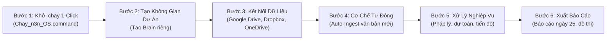

# 📖 HƯỚNG DẪN SỬ DỤNG HỆ ĐIỀU HÀNH TRỢ LÝ AI "n3n OS"
### CẨM NANG VẬN HÀNH THỰC HÀNH DÀNH CHO CÁN BỘ & CHUYÊN VIÊN BAN QLDA
> **Áp dụng cho:** Toàn thể cán bộ, chuyên viên Ban QLDA Đầu tư Xây dựng & Bộ phận Chuyển đổi số  
> **Nguyên tắc vận hành:** 1-Click đơn giản • Chạy Local 100% không lo rò rỉ dữ liệu • Tự động hóa liên tục

---

## 📌 QUY TRÌNH VẬN HÀNH 6 BƯỚC KHÉP KÍN

---

## BƯỚC 1: KHỞI CHẠY HỆ THỐNG (AI CŨNG LÀM ĐƯỢC)

Không cần mở terminal hay gõ bất kỳ dòng lệnh nào, bạn chỉ cần:

1. **Khởi động:**
   * Mở thư mục `Antigravity 2.0` trên máy tính.
   * **Nhấp đúp chuột (Double-click)** vào tệp:  
     👉 **`Chay_n3n_OS.command`**
   * Màn hình trình duyệt web sẽ tự động bật lên giao diện n3n OS tại địa chỉ:  
     `http://127.0.0.1:7777`
   * *(Mô hình AI `qwen2.5:32b` chạy offline trên máy tính đã được nạp sẵn, hoàn toàn bảo mật và không cần mạng Internet).*
2. **Tắt ứng dụng khi hết giờ làm việc:**
   * Nhấp đúp chuột vào tệp:  
     👉 **`Dung_n3n_OS.command`**

---

## BƯỚC 2: TẠO KHÔNG GIAN DỰ ÁN MỚI (SECOND BRAIN)

Để dữ liệu các công trình không bị lẫn lộn, mỗi Dự án đầu tư xây dựng nên là một "Bộ não" (Brain) độc lập.

1. Nhìn lên góc trên cùng bên trái của màn hình (cạnh logo n3n OS).
2. Bấm vào nút **`[+]`** (Tạo brain mới).
3. Gõ tên dự án viết liền hoặc có dấu gạch dưới, ví dụ:
   * `DA_Duong_Giao_Thong_Tan_Lap`
   * `DA_Truong_Mam_Non_Tan_Phu`
   * `DA_He_Thong_Thoat_Nuoc_KDC`
4. Bấm **Xác nhận**. Hệ thống sẽ lập tức tạo ra một không gian làm việc số với cấu trúc chuẩn gồm:
   * `sources/`: Nơi lưu trữ văn bản gốc (Quyết định, Tờ trình, Hợp đồng, File PDF scan, Bản vẽ).
   * `wiki/`: Kho tri thức đúc kết (Định mức, Đơn giá, Mốc thanh toán, Tiêu chuẩn kỹ thuật).
   * `memory/`: Ký ức về các quyết định, chỉ đạo của Lãnh đạo Ban.
   * `01 - Daily Log/`: Nhật ký công trình và tiến độ hàng ngày.

---

## BƯỚC 3: KẾT NỐI DỮ LIỆU ĐÁM MÂY (GOOGLE DRIVE, DROPBOX, ONEDRIVE)

Tất cả hồ sơ dự án của bạn trên Google Drive, Dropbox hoặc OneDrive đều có thể đưa vào n3n OS theo 2 cách cực kỳ nhanh:

### Cách A: Kéo thả trực tiếp trên giao diện (Đơn giản nhất)
* Mở thư mục chứa file trên Google Drive / Dropbox / OneDrive trên máy tính.
* **Kéo file (hoặc nhiều file PDF, Word, Excel, Bản vẽ)** và **thả thẳng vào khung trò chuyện** của n3n OS.
* Nhập kèm câu lệnh:  
  `"Lưu vào source và phân tích hồ sơ này"`

### Cách B: Trỏ thẳng thư mục Đám mây vào n3n OS (Dữ liệu lớn)
* Trên thanh điều khiển trên cùng của n3n OS, bấm nút **`[📁]`** *(Chọn brain từ folder ngoài)*.
* Chọn thẳng thư mục dự án đang nằm trên `~/Google Drive/Ban_QLDA/Cong_trinh_A` hoặc `~/Dropbox/...`.
* Toàn bộ tài liệu sẽ lập tức xuất hiện trong n3n OS mà không tốn thêm dung lượng ổ cứng.

---

## BƯỚC 4: CƠ CHẾ TỰ ĐỘNG CẬP NHẬT KHI CÓ VĂN BẢN MỚI (AUTO-INGEST)

Khi nhà thầu, đơn vị tư vấn thiết kế hoặc UBND gửi văn bản scan/file mới vào thư mục đám mây, n3n OS có thể tự động "tiêu hóa" (Ingest) mà bạn không cần làm thủ công:

### Cách thức hoạt động:
1. **Thư mục Hộp thư đến (`sources/inbox/`):**
   * Bạn tạo một thư mục con `inbox` trong dự án và chia sẻ link Google Drive/Dropbox này cho nhà thầu hoặc văn thư.
   * Bất kỳ khi nào có file mới thả vào đây, n3n OS sẽ nhận diện.
2. **Cơ chế Vòng lặp tự động (Loop):**
   * Vào menu **Việc** $\rightarrow$ chọn **Việc định kỳ**.
   * Nhập lệnh tạo vòng lặp:  
     `"Mỗi ngày lúc 08:00 và 14:00, hãy kiểm tra thư mục sources/inbox, đọc tất cả văn bản mới gửi đến, tóm tắt nội dung chính và cập nhật vào bảng Kanban"`
   * **Kết quả:**
     * n3n OS tự động đọc văn bản (hỗ trợ OCR cả file scan tiếng Việt).
     * Tự động gắn thẻ liên kết `[[Ten_Du_An]]`, `[[Nha_Thau_Thi_Cong]]`.
     * Nếu văn bản có thời hạn xử lý (ví dụ: hạn nộp hồ sơ trước ngày 15), AI tự động tạo thẻ công việc nhắc hạn trên bảng **Kanban**.

---

## BƯỚC 5: XỬ LÝ CÁC NGHIỆP VỤ THỰC TẾ TẠI BAN QLDA

Sau khi dữ liệu đã nạp vào, cán bộ chuyên viên có thể ra lệnh bằng văn bản hoặc bấm micro nói trực tiếp:

### 1. Tra cứu & Đối chiếu Tính Pháp Lý Văn Bản
* **Câu lệnh mẫu:**  
  * *"Công trình đường Tân Lập áp dụng hình thức chỉ định thầu hay đấu thầu rộng rãi theo Luật Đấu thầu 2023? Hãy trích dẫn điều khoản cụ thể."*  
  * *"Kiểm tra xem biên bản nghiệm thu giai đoạn này đã đủ chữ ký của Tư vấn giám sát và Chỉ huy trưởng chưa?"*
* **Kết quả:** n3n OS tra cứu trực tiếp trong kho Wiki và trả lời chính xác số Điều, Khoản, ngày ký quyết định.

### 2. Rà soát Hồ Sơ Dự Toán & Đơn Giá Xây Dựng
* **Câu lệnh mẫu:**  
  * *"Hãy kiểm tra bảng dự toán công trình Trường Mầm Non đính kèm, so sánh các mã hiệu định mức bê tông móng xem có áp dụng đúng Thông tư 12/2021/TT-BXD không?"*
* **Cơ chế phối hợp tác tử:** n3n OS sẽ tự động kích hoạt **DeepSeek Harness** chạy phân tích suy luận sâu (*Deep Reasoning*) để soi các sai lệch về khối lượng và hao phí vật tư, sau đó đưa ra bảng cảnh báo chi tiết.

### 3. Theo dõi Tiến Độ Thi Công & Nhật Ký Công Trường
* **Câu lệnh mẫu:**  
  * *"Cập nhật nhật ký ngày 29/09: Đã đổ xong 120m2 bê tông sàn tầng 2 Trường Mầm Non, thời tiết nắng tốt, kiểm tra độ sụt đạt yêu cầu."*
* **Kết quả:** AI tự động ghi vào `01 - Daily Log/2026-09-29.md` và cập nhật tỷ lệ hoàn thành lũy kế của hạng mục kết cấu.

### 4. Soạn Thảo Nhanh Tờ Trình, Báo Cáo Hành Chính
* **Câu lệnh mẫu:**  
  * *"Soạn thảo Tờ trình gửi UBND xã phê duyệt kết quả lựa chọn nhà thầu gói thầu số 01 xây lắp công trình đường Tân Lập theo chuẩn thể thức Nghị định 30/2020."*
* **Kết quả:** AI xuất ra bản thảo hoàn chỉnh đầy đủ căn cứ pháp lý, thông tin giá gói thầu, tên nhà thầu trúng thầu để in hoặc copy sang Word.

---

## BƯỚC 6: XUẤT BÁO CÁO KẾT QUẢ PHỤC VỤ LÃNH ĐẠO

### 1. Báo cáo Tiến độ Định kỳ Ngày 25 Hàng Tháng
* **Câu lệnh mẫu:**  
  * *"Hãy lập Báo cáo tiến độ và giải ngân vốn đầu tư công tháng này theo biểu mẫu chuẩn của Ban QLDA Xã Tân Phú"*
* **Kết quả:** AI tổng hợp từ tất cả các dự án đang quản lý:
  * Tổng vốn được giao năm 2026.
  * Tỷ lệ giải ngân lũy kế đến ngày 25.
  * Khối lượng thi công thực tế tại hiện trường từng công trình.
  * Khó khăn, vướng mắc (về mặt bằng, điều chỉnh thiết kế) và kiến nghị đề xuất.

### 2. Xem Đồ Thị Tri Thức Trực Quan (Knowledge Graph)
* Vào menu **Bộ não** $\rightarrow$ chọn **Đồ thị tri thức**.
* Toàn bộ hệ thống sẽ hiện ra dạng quả cầu mạng nhện:
  * Nút trung tâm: Dự án đầu tư xây dựng.
  * Các nút vệ tinh liên kết: Nhà thầu thi công, Quyết định phê duyệt, Hợp đồng, Nhật ký thi công, Hồ sơ thanh toán.
  * Rất trực quan để trình chiếu trong các cuộc họp giao ban với UBND xã.

### 3. Nhận Báo Cáo Di Động Qua Zalo / Telegram
* Khi đang đi công tác hoặc ngoài công trường không có máy tính, bạn chỉ cần mở Zalo nhắn cho **ABS Zalo Bot** hoặc Telegram nhắn cho **`@Tao_lich_bot`**:  
  *"Báo cáo nhanh tình hình giải ngân dự án đường Tân Lập"*  
* **Hermes Agent** sẽ truy vấn Second Brain của n3n OS và gửi ngay kết quả tóm tắt vào điện thoại của bạn.
