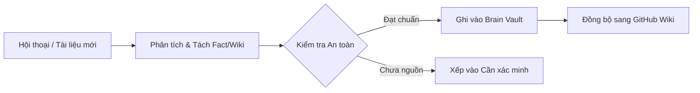

# 🤖 Cơ Chế Tự Học Của n3n OS (Self-Learning Engine)

n3n OS được trang bị Engine Tự Học độc lập (`server/learn.py`), vận hành theo các nguyên tắc an toàn dữ liệu khắt khe:

### 1. Chu Trình Tự Học (Learning Lifecycle)

### 2. Các Tầng Tri Thức (Provenance Tiers)
1. **Facts (Ký ức thực chứng)**: Lưu lại các thông tin chắc chắn về dự án (nhà thầu, giá trị, thời hạn, văn bản chỉ đạo).
2. **Wiki Concepts (Khái niệm tái dùng)**: Các quy trình, biểu mẫu, cách thức giải quyết công việc có tính quy luật.
3. **Skills (Kỹ năng mới)**: Khi AI học được cách xử lý một loại công việc mới, nó tự sinh skill để tái sử dụng.

### 3. Đồng Bộ Trực Tiếp Lên GitHub Wiki
* Bất cứ khi nào hệ thống đúc kết được kiến thức mới, module `sync_wiki.py` sẽ tự động chuyển hóa thành các trang tài liệu Markdown và đẩy lên kho lưu trữ GitHub Wiki của đơn vị.

*Cập nhật tự động: 03/10/2026 09:10:49*
